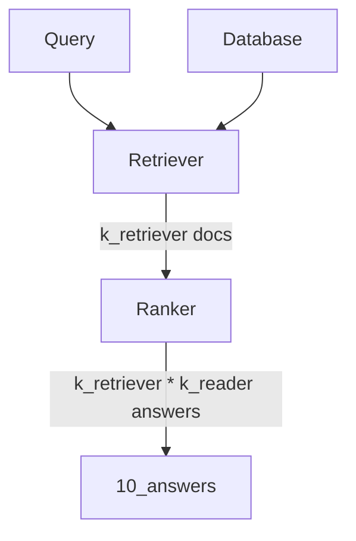

report january
===
# Testing the Haystack Pipelines

## Context
At the dawn of launching a new project on the CRPA data to further test the opportunity of using PIAF in the context of the French administration, we were facing concerns regarding the standardization of the data we were to feed to PIAF.

We want to be able to launch a new instance of PIAF with as few human intervention as possible. However the performance of the whole pipeline is much influenced by the size of the knowledge base available for searching. We also know that many parameters will influence the answer retrieval in terms of quality (number of correct retrievals) and response-time. These parameters can be : document length, number of documents retreived, number of answers requested per documents, among others.

We have found out that some general feeling of how the performances are affected by the parameters can be acquired by running experiments on general purpose SQuAD-formated datasets, based on Wikipedia articles. However, it will be necessary to fine tune every specific use case to make sure that the parameters are the best possibe. Also, this report help us to deploy a solution that has been properly evaluated. 

## Solution
In order to use our solution, we first need to transform the input data into a standard format that will be used during the whole set of PIAF tools developed.

The natural solution was to turn the data to the SQuAD format. Our final goal is to aim at a solution where you would only have to process your data in the squad format. You would then launch the piaf annotation platform to annotate yourself the data. The annotated data will then be used to fine tune and launch your QA solution. 

## Sprint content 
This sprint aims at implementing the solution allowing the evaluation of the PIAF solution. We wanting to use as much as possible the functions developped by the haystack team but also implement some testing on our side for implementing a proper git flow. We implemented this testing with the pytest library. 

We also wanted to gain more insights as to what are the best parameters to get an optimized solution for questionning the service-public.fr knowledge base. 

## Test
### Test objectives 
Get a feeling of how the parameters can affect the performance of haystack. Either in terms of quality of answering or performances for the time of answering. 

### Behaviour


### Dataset
The results presented in this report were generated using the dataset full_spf_squad V1.0. This datasets consists in 3068 contexts and 538 questions, of which 127 have answers. 

### Hardware 
The test was run on GPU_bro

### Deviations
There were some unknown bug preventing from running all the tests that were intended to be done. This is especially the case for the lowest value of ```split_length``` (100). For more information on this bug, please check [this](https://github.com/huggingface/transformers/issues/11354). 
Due to this bug, we changed the parameters that we studied. See test set up. 

### Test set up
The configurations of the Pipeline that are tested are the following : 
"k_retriever": [1,5,20,50,100],
"k_title_retriever" : [10], # must be present, but only used when retriever_type == title_bm25
"k_reader_per_candidate": [1,5,10,20],
"k_reader_total": [5,10,20],
"retriever_type": ["bm25"], # Can be bm25, sbert, dpr, title or title_bm25
"squad_dataset": ["./data/evaluation-datasets/full_spf_squad.json"],
"filter_level": [None],
"preprocessing": [True],
"boosting" : [1], #default to 1
"split_by": ["word"],  # Can be "word", "sentence", or "passage"
"split_length": [10000000],
"experiment_name": ["rr_20210420"]

- Transformers reader with "etalab-ia/camembert-base-squadFR-fquad-piaf" model
- The embedding retriever is using the following model : https://huggingface.co/distilbert-base-multilingual-cased

Each question of the dataset is queried to the Pipeline and we verify the Pipeline answer vs the answer annotated in full_spf_squad.

## Results 
### Accuracy
If the answer given by the pipeline is contained or contains the correct answer, then the answer is considered valid. The accuracy is the percentage of valid answers over the query passed to the pipeline.

The top1 accuracy is the accuracy of the pipeline, considering only the first answer. The topk accuracy is the accuracy of the pipeline using all of the 10 answers given at the end of the pipeline. 

For k_reader_total (ou k_display) = 5  
Best results are achieved with a low k_retriever. Above k_reader_per_candidate = 5, there is no impact of this parameter on the results


There is a quite low probability of finding the answer in the top. This probability strongly depends from the k_retriever but is not affected by k_reader_per_candidate


As one could expect, increasing the k_reader_total increases the chances of finding the correct answer. However, for the user experience to be optimal, we believe that no more than 5 answers should be diplayed for a query. 
Here is an exemple with k_reader_total = 20


We modelize the behavior of the performance VS the parameters ``['k_reader_per_candidate', 'k_reader_total', 'k_retriever']`` with a polynomial equation of degree 3. R² = 0.933. 

The parameters having the most impact on the results are ``['k_reader_per_candidate', 'k_retriever','k_reader_per_candidate k_reader_total']``


### Time for retrieval
The time for question answering increases linearly when k_retriever increases.  


The time for question answering increases  when k_reader_per_candidate increases.  


The time for question answering is mainly related to k_retriever 


## Conclusion
We saw on this dataset that the best performances are achieved with low k_retriever (1) and high k_reader_per_candidate (20).
For this setting, and this dataset, the top_k accuracy is 52%. 
Better results might be achieved with custom pipelines or title boosting and this will be further investigated. 