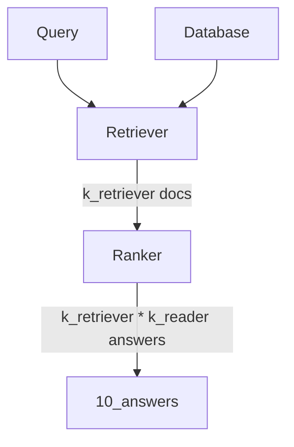

# Testing the Haystack Pipelines

## Context

At the dawn of launching a new project on the CRPA data to further test the opportunity of using PIAF in the context of
the French administration, we were facing concerns regarding the standardization of the data we were to feed to PIAF.

We want to be able to launch a new instance of PIAF with as few human intervention as possible. However the performance
of the whole pipeline are very much influenced by the size of the knowledge base at disposable for searching. We also
know that many parameters will influence the answer retrieval in terms of quality (number of correct retrievals) and
performances (time necessary for retrieval). These parameters can be : document length, number of documents retreived,
number of answers requested per documents.

It is accepted that some knowledge and orders of magnitude can be acquired by running experiments on general purposed
squad formated dataset generated based on Wikipedia articles. However, we believe that it will be necessary to fine tune every project to make sure that the parameters are optimized. Also, one cannot imagine putting to production a solution that has not been properly evaluated. 

## Solution

In order to use our solution, we thus need to format our data in a form that will be always the same so that every other piece of software we use in the processing the data does not need to be tuned to the use case. 

Our natural solution was to turn to the SQUAD format. Our final goal is to aim at a solution where you would only have to process your data in the squad format. You would then launch the piaf annotation platform to annotate yourself the data. The annotated data will then be used to fine tune and launch your QA solution. 

## Sprint content 
This sprint aims at implementing the solution allowing the evaluation of the PIAF solution. We wanting to use as much as possible the functions developped by the haystack team but also implement some testing on our side for implementing a proper git flow. We implemented this testing with the pytest library. 

We also wanted to gain more insights as to what are the best parameters to get an optimized solution for questionning the service-public.fr knowledge base. 

## Test
### Test objectives 
Get a feeling of how the parameters can affect the performance of haystack. Either in terms of quality of answering or performances for the time of answering. 

### Behaviour


### Dataset
The results presented in this report were generated using the dataset full_spf_squad V1.0. This datasets consists in 3068 contexts and 538 questions, of which 127 have answers.

### Test set up
The contexts are preprocessed and added to the knowledge base. The preprocessing function can split the context as per a defined number of words that varies as follow : [10, 100, 1000]
The pipeline is set up with the following components : 
- BM25 retriever
- Transformers reader with "etalab-ia/camembert-base-squadFR-fquad-piaf" model

The configurations of the Pipeline that are tester are the following : 
- “k_retriever”: [1,5,20,50,100],
- “k_reader”: [1,5,20,50,100].

Each question of the dataset is queried to the Pipeline and we verify the Pipeline answer vs the answer annotated in full_spf_squad.

### Hardware 
Due to the length of the test, the test was set up to run on 5 different instances with GPU. As it is already known that the number of k_retriever has the biggest impact on the test duration, these values were evenly spread over the different instances. Therefore each instance was given a specific number of k_reader to process. We cannot assume that the configuration was exactly the same for each machine and therefore great caution should be taken when comparing the durations for processing the data between the different values of k_reader. 

### Deviations
There were some unknown bug preventing from running all the tests that were intended to be done. This is especially the case for the lowest value of ```split_lenth``` and for the hightest values of ```k_reader```. These values will be filtered out in the analysis as necessary as to keep things comparable. 

| k_retriever\k_reader | 1   | 5   | 20  | 50  | 100 |
| -------------------- | --- | --- | --- | --- | --- |
| 1                    | 3   | 3   | 3   | 3   | 3   |
| 5                    | 3   | 3   | 3   | 2   | 2   |
| 20                   | 3   | 3   | 2   | 2   | 1   |
| 50                   | 3   | 3   |     |     |     |
| 100                  | 2   | 2   |     |     |     |

| k_reader | k_retriever | 100 | 1000 | 10000 |
| -------- | ----------- | --- | ---- | ----- |
| 1        | TOT         | 5   | 5    | 5     |
|          | 1           | 1   | 1    | 1     |
|          | 5           | 1   | 1    | 1     |
|          | 20          | 1   | 1    | 1     |
|          | 50          | 1   | 1    | 1     |
|          | 100         | 1   | 1    | 1     |
| 5        | TOT         | 3   | 5    | 5     |
|          | 1           | 1   | 1    | 1     |
|          | 5           | 1   | 1    | 1     |
|          | 20          | 1   | 1    | 1     |
|          | 50          |     | 1    | 1     |
|          | 100         |     | 1    | 1     |
| 20       | TOT         | 2   | 5    | 4     |
|          | 1           | 1   | 1    | 1     |
|          | 5           | 1   | 1    | 1     |
|          | 20          |     | 1    | 1     |
|          | 50          |     | 1    | 1     |
|          | 100         |     | 1    |       |
| 50       | TOT         | 2   | 2    | 2     |
|          | 1           | 1   | 1    | 1     |
|          | 5           | 1   | 1    | 1     |
| 100      | TOT         |     | 2    | 2     |
|          | 1           |     | 1    | 1     |
|          | 5           |     | 1    | 1     |

## Results 
### Accuracy
If the answer given by the pipeline is contained or contains the correct answer, then the answer is considered valid. The accuracy is the percentage of valid answers over the query passed to the pipeline.

The top1 accuracy is the accuracy of the pipeline, considering only the first answer. The topk accuracy is the accuracy of the pipeline using all of the 10 answers given at the end of the pipeline. 

k_retriever and k_reader have a strong influence on the top k accuracy. 
There is a plateau effect after 20 k_retriever and 50 k_reader.  


However, increasing k_reader and k_retriever decrease the probability of finding the correct answer in the first position


The length of the documents processed also have an impact although it is smaller. 


### Time for retrieval 
Due to the spreading of the experiment on several machine the analysis of the timing for the retrieval of the answer by the pipeline cannot be performed with different values of k_reader. 

Here are the values collected during the experiment.

The time for question answering increases linearly when k_retriever increases.  


The time for question answering increases with longer documents. 


Other experiments run previously had shown that k_reader has no impact on the question answering time. 

## Conclusion
There is a tradeoff between the seek for high accuracy and speed of the answer. k_retriever 
Good tradeoff parameters in our case could be k_reader = k_retriever = 20, document length = 100. 

## Next 
In a real application, the user would not be given 10 answers by the system but maybe 1 or 3 values. 
With the current state of the code we are not able to test the sensibility of the performances when this value changes. 
However, seeing the dramatical decrease of performance on top1_accuracy, this is something that should be investigated in future work. 


